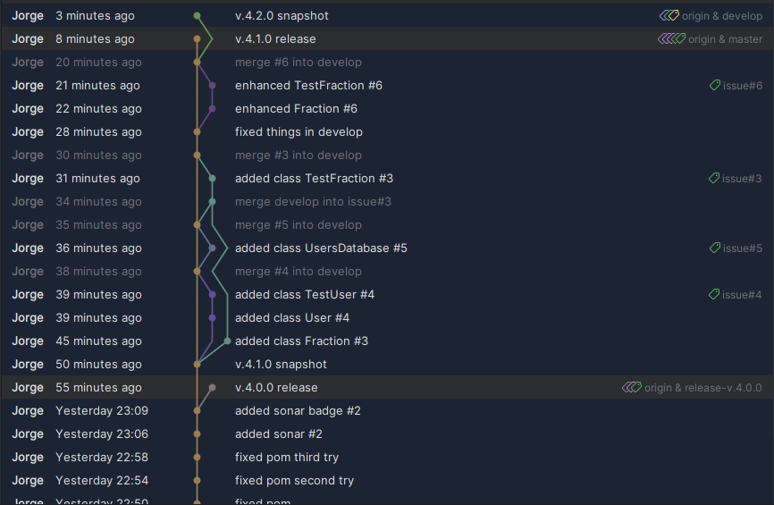
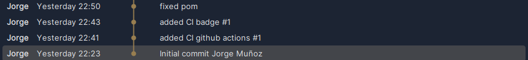

## [Máster en Ingeniería Web por la Universidad Politécnica de Madrid (miw-upm)](http://miw.etsisi.upm.es)
## Ingeniería Web: Visión General (IWVG) DevOps
> Este proyecto es una Plantilla de apoyo docente de la asignatura.

